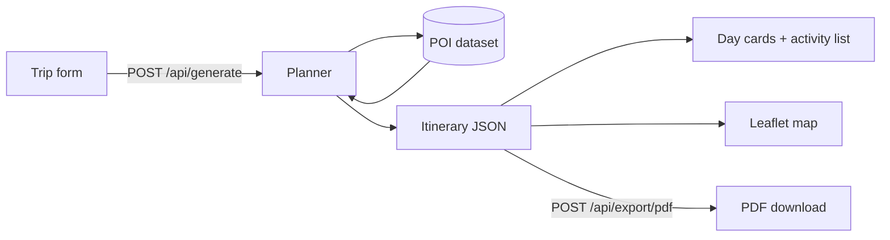

# travel-itinerary-builder

I got tired of spending two hours with twelve browser tabs open every time I wanted to plan a trip. The usual flow — copy a blog post into a notes app, cross-reference opening hours, guess at how far things are from each other, realise you've accidentally scheduled the Louvre and Versailles on the same day — wasn't working for me.

So I built this. You pick a destination, tell it how long you're staying, what you care about (food, history, art, nightlife, whatever), and your rough budget. It figures out the rest: a day-by-day schedule that clusters stops geographically, inserts meals at sensible times, respects opening hours, and gives you a rough cost breakdown. No AI, no subscriptions, no internet required for the planner itself — just a deterministic algorithm over a hand-curated dataset.

The whole thing renders on an interactive map with numbered pins and a route line. You can drag activities to reorder them, edit any detail inline, and export the final plan as a PDF to print or email.

---

## What it looks like

Left side: a form where you configure your trip — destination, dates, number of people, budget tier, interests. Submit it and the left panel fills with a day-by-day breakdown, each day collapsible, each activity showing time, cost, address, and a short description. Right side: a Leaflet map with numbered pins (color-coded by type — blue for attractions, red for restaurants, purple for museums) and a dashed blue route line between them. Filter by day with the tab bar above the map.

The data lives entirely in your browser session. Nothing is stored on a server. Close the tab and it's gone — or hit **Export PDF** first.

---

## Features

- **Deterministic planning** — same inputs, same trip, every time. Great for sharing with travel companions.
- **Geographic clustering** — each day stays in one neighbourhood, minimising travel between stops.
- **Smart meal scheduling** — lunch around noon, dinner around 7pm, picked from the nearest available restaurant in the dataset.
- **Budget filtering** — three tiers (budget / mid-range / luxury), applied to both activities and restaurants.
- **Interest tags** — history, art, food, nature, nightlife, adventure. Mix and match.
- **Opening hours awareness** — the planner won't book you into a museum that's closed.
- **Interactive Leaflet map** — OpenStreetMap tiles, numbered markers, dashed route polyline, per-day filter tabs.
- **Drag-to-reorder** — change the order of any day's activities by dragging them.
- **Inline editing** — click Edit on any activity and change the name, time, duration, or tips.
- **PDF export** — clean printable layout with all days, costs, and packing tips.
- **Destination geocoding** — type a city and it resolves the coordinates via OpenStreetMap Nominatim (for the map center).

**Currently supported cities:** Paris, Tokyo, Rome — each with 25+ curated points of interest.

---

## Stack

| | Tech |
|---|---|
| **Frontend** | React 18 + TypeScript, Vite, Tailwind CSS v4, Leaflet + react-leaflet, Zustand |
| **Backend** | FastAPI (Python 3.11), Pydantic v2, httpx |
| **PDF** | WeasyPrint |
| **Geocoding** | OpenStreetMap Nominatim |
| **Tests** | pytest + pytest-asyncio |
| **Containers** | Docker + Docker Compose |

---

## Quick start

### Docker (easiest)

```bash
git clone https://github.com/omprxkash/travel-itinerary-builder.git
cd travel-itinerary-builder
docker compose up --build
```

Open [http://localhost:3000](http://localhost:3000).

That's it. The backend starts on port 8000 and the frontend proxies API calls through nginx. No config needed.

### Running locally (for development)

**Backend:**

```bash
cd backend
python -m venv venv
source venv/bin/activate   # Windows: venv\Scripts\activate
pip install -r requirements.txt
cp .env.example .env
uvicorn main:app --reload
```

The API is now at [http://localhost:8000](http://localhost:8000). You can test it immediately:

```bash
curl -X POST http://localhost:8000/api/generate \
  -H "Content-Type: application/json" \
  -d '{
    "destination": "tokyo",
    "start_date": "2025-11-01",
    "end_date": "2025-11-05",
    "num_travelers": 2,
    "budget_level": "mid-range",
    "interests": ["food", "history"]
  }'
```

**Frontend:**

```bash
cd frontend
npm install
npm run dev
```

The app is now at [http://localhost:5173](http://localhost:5173) with hot reload. API calls proxy to the backend automatically.

---

## How the planner works

The algorithm lives entirely in [`backend/services/planner_service.py`](backend/services/planner_service.py). Here's the rough flow:



**Step by step:**

1. **Load** the curated POI dataset for the chosen city (`data/poi/<city>.json`). Each POI has a name, type, coordinates, tags, cost tier, duration, and opening hours.

2. **Filter** by interests (tag overlap) and budget tier. If the filter leaves fewer than 10 POIs, it relaxes the interest constraint and keeps only the budget filter — so you always get a full itinerary.

3. **Cluster geographically.** For each day, the algorithm picks a seed POI and sorts the remaining candidates by haversine distance. This keeps each day's stops in the same part of the city.

4. **Time-block the day** starting from 09:00. Attractions and museums are scheduled in sequence, respecting each POI's duration and opening hours. A 20-minute buffer is added between stops.

5. **Insert meals** at lunch (~12:00) and dinner (~19:00) by picking the nearest available restaurant in the dataset. The restaurant pool resets across days so you don't see the same place twice.

6. **Attach transport tips** between stops more than 1 km apart — walk, metro, or taxi suggestions based on distance.

7. **Estimate costs** based on the budget tier and POI type, and roll up per-day and total budget estimates.

No external API calls, no randomness. Every output is fully deterministic given the same inputs.

---

## Project structure

```
travel-itinerary-builder/
│
├── backend/
│   ├── main.py                      # FastAPI app, CORS, router registration
│   ├── models/
│   │   └── schemas.py               # Pydantic models (TripInput → Itinerary)
│   ├── routers/
│   │   ├── itinerary.py             # POST /api/generate, GET /api/cities
│   │   ├── geocoding.py             # GET /api/geocode?q=
│   │   └── export.py                # POST /api/export/pdf
│   ├── services/
│   │   ├── planner_service.py       # Core algorithm (read this first)
│   │   ├── geocoding_service.py     # Nominatim wrapper
│   │   └── pdf_service.py           # WeasyPrint HTML → PDF
│   ├── data/poi/
│   │   ├── paris.json               # 26 curated POIs
│   │   ├── tokyo.json               # 26 curated POIs
│   │   └── rome.json                # 25 curated POIs
│   └── tests/
│       └── test_itinerary.py        # 10 tests covering plans, filters, geocode
│
├── frontend/
│   └── src/
│       ├── api/client.ts            # Typed fetch wrappers for all endpoints
│       ├── store/tripStore.ts       # Zustand store (trip state + edit/reorder)
│       ├── hooks/
│       │   ├── useGenerateItinerary.ts
│       │   └── useGeocoding.ts      # Debounced geocoding
│       └── components/
│           ├── TripForm/            # Form + interest tag chips
│           ├── Itinerary/           # Day cards, activity cards, edit modal
│           ├── Map/                 # Leaflet map, numbered markers, route line
│           └── Export/              # PDF export button
│
├── docker-compose.yml
└── README.md
```

---

## API reference

```
POST /api/generate
  Body: { destination, start_date, end_date, num_travelers, budget_level, interests }
  Returns: full Itinerary object

GET  /api/cities
  Returns: list of cities with curated POI data

GET  /api/geocode?q=<query>
  Returns: { lat, lng, display_name }

POST /api/export/pdf
  Body: Itinerary object
  Returns: application/pdf
```

The schemas are defined in [`backend/models/schemas.py`](backend/models/schemas.py) and the FastAPI auto-generated docs are at `http://localhost:8000/docs`.

---

## Adding a new city

The dataset is just a JSON file. To add Barcelona (or anywhere):

1. Create `backend/data/poi/barcelona.json` — an array of POI objects following this shape:

```json
{
  "name": "Sagrada Família",
  "type": "landmark",
  "lat": 41.4036,
  "lng": 2.1744,
  "address": "Carrer de Mallorca, 401, Barcelona",
  "tags": ["history", "architecture", "art"],
  "avg_cost": "mid-range",
  "duration_minutes": 120,
  "open_hours": "09:00-18:00",
  "description": "Gaudí's still-unfinished masterpiece..."
}
```

2. Add the city's center coordinates to the `meta` dict in `planner_service.py` so the map centers correctly.

3. Add a few packing tips to the `PACKING_TIPS` dict in the same file.

4. That's it — the city shows up automatically in `/api/cities` and accepts bookings from the planner.

A good dataset has 20–30 POIs with a healthy mix of types (attraction, museum, restaurant, park, landmark) and budget tiers (budget, mid-range, luxury). Too few restaurants and the meal insertion falls back to repeats; too few attractions and some days will be sparse.

---

## Tests

```bash
cd backend
pytest -v
```

The test suite covers:
- 5-day Tokyo plan produces 5 days each with ≥ 2 activities
- 3-day Paris and 2-day Rome plans
- Budget filter doesn't include luxury-tier costs on a budget trip
- Single-day trip works correctly
- Summary string includes the specified interests
- At least some activities have GPS coordinates
- All three cities are present in `/api/cities` with 25+ POIs
- Unknown destination raises a `ValueError`
- Geocode endpoint (mocked Nominatim response)

Frontend type checking:
```bash
cd frontend
npm run build   # tsc -b && vite build
```

---

## Known limitations

- **Only three cities.** The planner only knows about Paris, Tokyo, and Rome. Any other destination returns a 404. Adding more is straightforward — see the section above.
- **No persistence.** Refresh the page and everything's gone. There's no login, no database, no saved trips. (Intentionally — keeps the project self-contained.)
- **Offline except for the map tiles.** The planner itself runs fully offline, but the Leaflet map needs OpenStreetMap tiles and the geocoding uses Nominatim — both require a connection.
- **WeasyPrint on Windows.** PDF export needs `libpango` and `libcairo`, which are straightforward on Linux/Mac and annoying on Windows. Use Docker if you're on Windows and want PDF to work.
- **Approximate opening hours.** The hours in the dataset are rough. Always double-check before you show up somewhere — especially for things like seasonal variations or public holidays.
- **Rough cost estimates.** The budget figures are order-of-magnitude estimates based on tier, not real-time prices. They're useful for ballpark planning, not budgeting to the euro.

---

## License

MIT © 2025 Om Prakash
